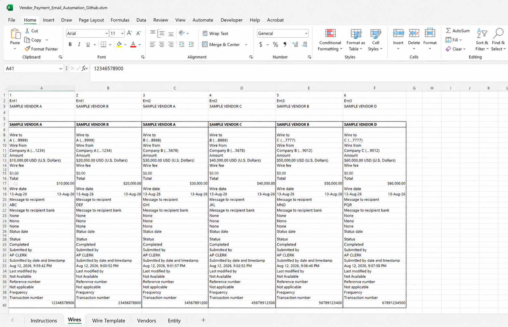
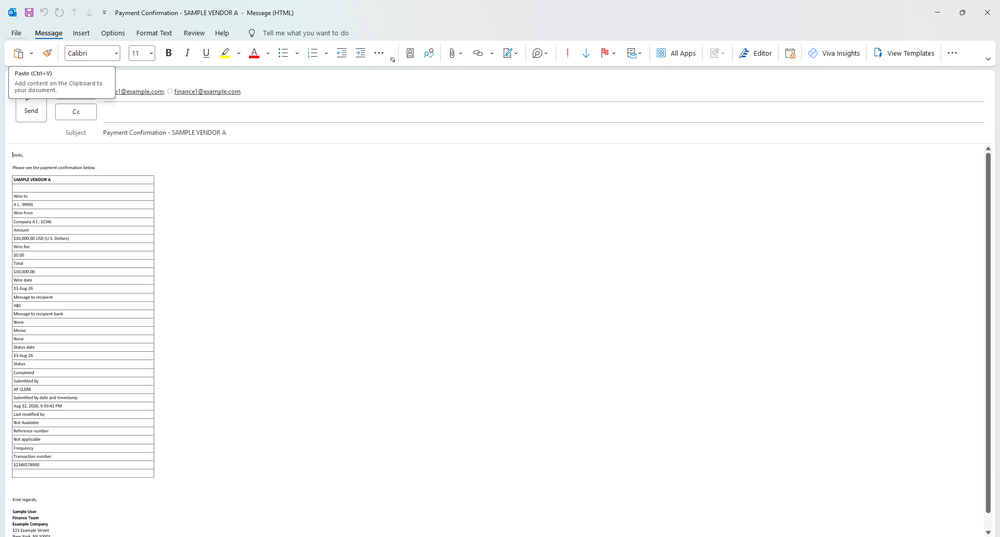

\# Vendor Payment Email Automation

An Excel-based automation tool that generates vendor payment notification emails using payment data from Microsoft Dynamics 365 Business Central.

\## Overview

Vendor Payment Email Automation was built to simplify the process of notifying vendors when electronic payments have been issued.

Instead of manually identifying paid invoices, preparing payment details, finding vendor contacts, and creating individual emails, the workbook combines Business Central data, Excel Power Query, and VBA to automate much of the workflow.

The automation prepares Outlook emails containing the applicable invoice and payment information for each vendor.

\## How It Works

The workflow is:

\*\*Dynamics 365 Business Central → OData/API → Power Query → Excel → VBA → Outlook\*\*

1\. Business Central provides vendor payment and vendor ledger data through OData/API connections.

2\. Power Query imports and transforms the Business Central data.

3\. Excel organizes payment information and vendor email recipients.

4\. VBA processes each payment notification.

5\. The applicable payment/invoice table is converted to HTML.

6\. Outlook emails are automatically created with the appropriate recipient, subject, message, and payment details.

7\. Processing status is recorded in Excel.

## Screenshots

### Payment Data

The workbook organizes electronic payment information for processing and vendor notification.

### Generated Vendor Payment Email

The automation creates a formatted Outlook email containing the applicable payment details. The public version is configured to display emails for review rather than automatically sending them.

\## Key Features

\* Connects Excel to Microsoft Dynamics 365 Business Central data

\* Uses Power Query for data retrieval and transformation

\* Identifies vendor payment information

\* Supports multiple email recipients and CC recipients

\* Generates vendor-specific payment notification emails

\* Inserts formatted Excel payment tables directly into the email

\* Preserves basic table formatting, including borders, bold text, and alignment

\* Tracks processing status within the workbook

\* Prevents already-processed rows from being processed again

\* Includes validation for missing email addresses and payment ranges

\* Supports review and automatic-send modes

\## Review Mode

The GitHub version is configured with:

`SEND\_EMAILS = False`

In this mode, the automation creates and displays Outlook emails for review but \*\*does not automatically send them\*\*.

Automatic sending can be enabled in the VBA code by changing the setting to:

`SEND\_EMAILS = True`

Users should thoroughly test the workbook and email output before enabling automatic sending.

\## Requirements

\* Microsoft Excel for Windows

\* Microsoft Outlook desktop

\* Microsoft Dynamics 365 Business Central

\* Access to the appropriate Business Central OData/API services

\* Excel macros enabled

\* Permission to access the required Business Central data

\## Business Central Connection

The production version of this project uses Business Central OData/API connections through Power Query.

Business Central URLs, tenant information, company information, credentials, vendor information, email addresses, and other organization-specific information have been removed or replaced in the public GitHub version.

Users implementing the project in their own environment will need to configure the Power Query connections for their own Business Central tenant, environment, companies, and available web services/API endpoints.

\## Demo Data

This repository contains a sanitized demonstration version of the workbook.

Company names, vendor names, email addresses, addresses, payment information, and other identifying information have been replaced with sample data.

The sample information is intended to demonstrate the structure and functionality of the automation only.

\## Technology Used

\* Microsoft Dynamics 365 Business Central

\* Business Central OData/API

\* Microsoft Excel

\* Power Query

\* VBA

\* Microsoft Outlook

\* HTML email formatting

\## Project Status

Functional working prototype.

The automation has been designed to support a real-world accounts payable workflow while keeping the public repository version separated from production company data and credentials.

\## Disclaimer

This project is provided as an example and should be fully tested before use in a production accounting environment.

Always verify payment information, vendor email addresses, Business Central connections, and generated emails before enabling automatic email sending.

